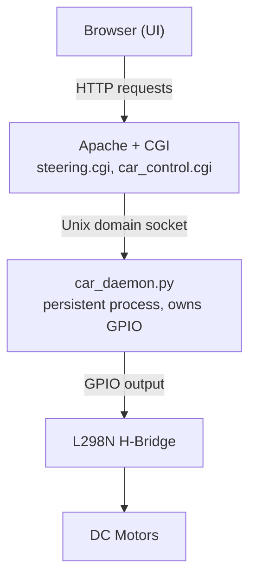
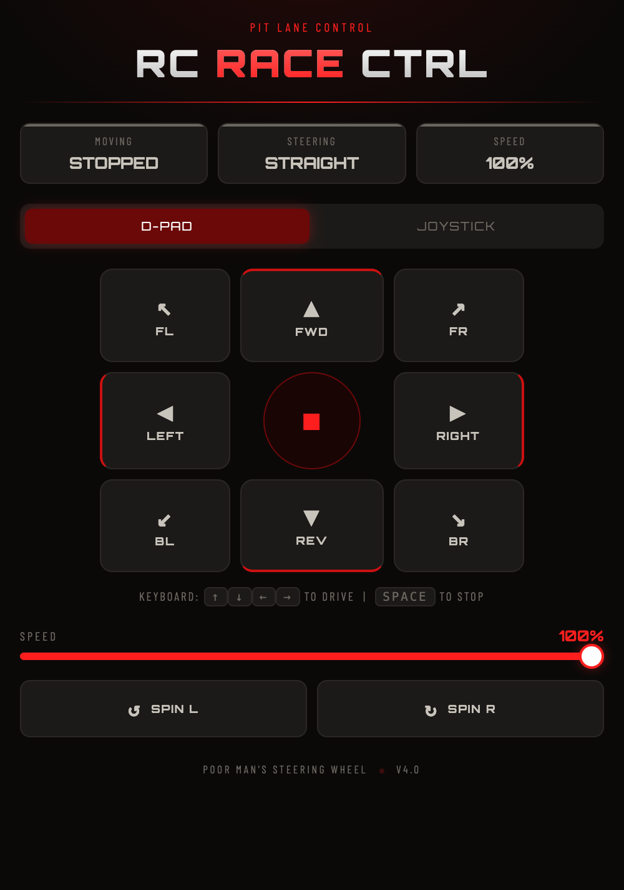
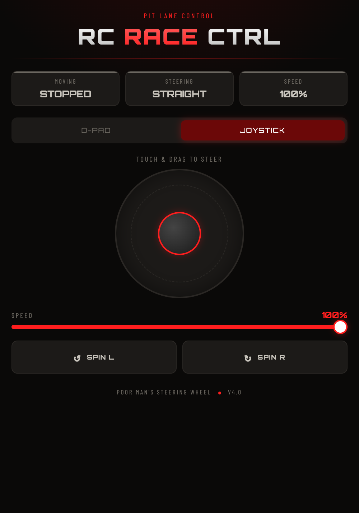
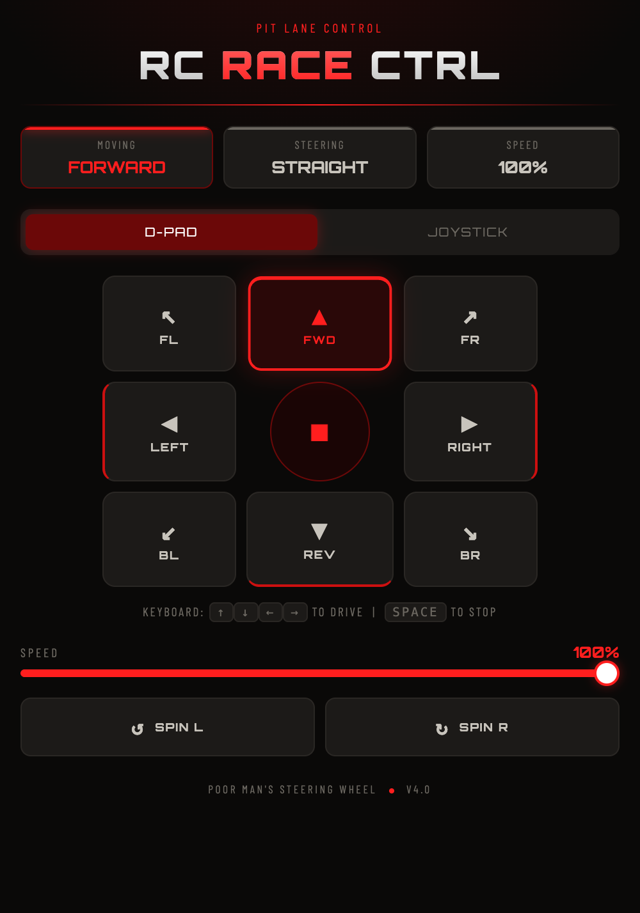
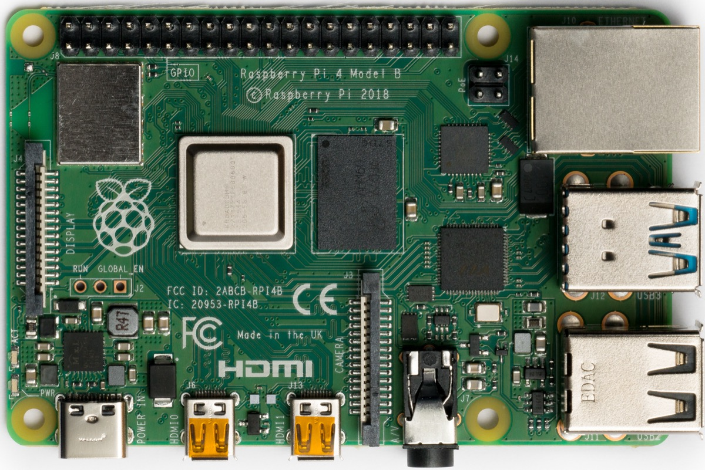
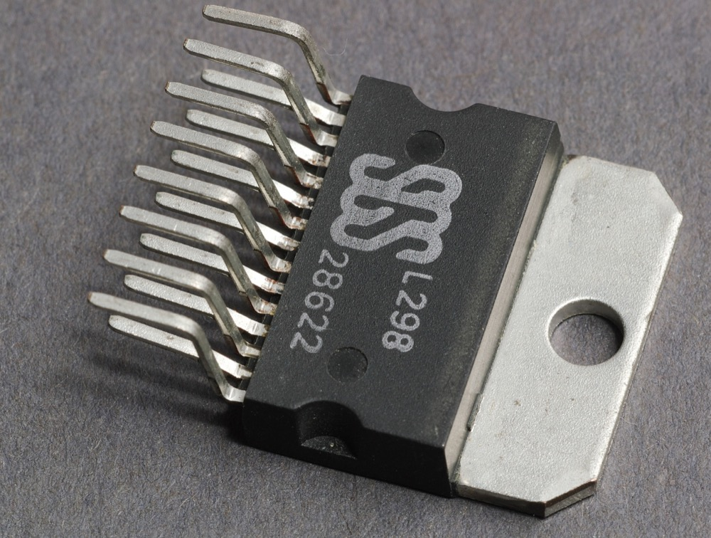

# 🏎️ RC Race Control


> **🏆 1st Place — BusITWeek Smart Car Race, Howest Bruges, April 2026 — fastest lap of the event.**

A browser-controlled RC car built on a Raspberry Pi. No app, no framework — a persistent GPIO daemon talks to a lightweight Apache CGI backend over a Unix socket, and a single-page UI drives it from any phone or laptop on the network.

<p align="center">
  
</p>

## Overview

The car is driven entirely from a web browser: a D-pad, a virtual joystick, and keyboard arrow keys, all communicating with the Pi over plain HTTP. There's no dependency beyond the Python standard library and `gpiozero` — no Node, no web framework, no build step.

The interesting engineering problem was **state persistence under GPIO**: pin states reset the instant a process exits, so a naive "run a script per HTTP request" design causes motors to fire for microseconds and immediately die. That killed our first prototype on the pit table an hour before the race. The fix is a long-running daemon that owns the GPIO pins for the lifetime of the program and exposes a Unix domain socket for control, decoupling motor state from request lifecycle entirely.

## Architecture



| Layer | File | Responsibility |
|---|---|---|
| UI | `steering.cgi` | Serves the full HTML/CSS/JS control interface |
| API | `car_control.cgi` | Bash CGI endpoint invoked by browser `fetch()` calls |
| Client | `car_control.py` | Unix socket client — translates a CLI arg into a socket command |
| Daemon | `car_daemon.py` | Long-running process holding GPIO state, listens on `/var/run/car.sock` |

Each layer is intentionally minimal and independently testable — `car_control.py` can be run from a terminal to drive the car without touching the browser at all, which was invaluable for debugging on hardware.

## Screenshots

<p align="center">
  
  
  
</p>

<p align="center"><em>D-pad, virtual joystick, and live telemetry while a command is held.</em></p>

## Hardware

| Component | Details |
|---|---|
| SBC | Raspberry Pi 4 |
| Motor driver | L298N H-bridge |
| Motors | 4× DC motors, differential drive |
| Power (Pi) | USB power bank |
| Power (motors) | 2× 4×AA battery packs |
| Chassis | Custom frame |

<p align="center">
  
  
</p>

<p align="center"><em>Raspberry Pi 4 Model B, and the L298 dual H-bridge IC that the L298N driver module is built around. Reference photos, not the actual build — <a href="https://commons.wikimedia.org/wiki/File:Raspberry_Pi_4_Model_B_-_Top.jpg">Pi 4 photo</a> © Laserlicht, <a href="https://creativecommons.org/licenses/by-sa/4.0/">CC BY-SA 4.0</a>; <a href="https://commons.wikimedia.org/wiki/File:L298_IMGP4533_wp.jpg">L298 photo</a> © Rainer Knäpper, Free Art License / GFDL 1.2.</em></p>

**GPIO mapping (BCM numbering):**

| Pin | Signal |
|---|---|
| GPIO 5 | IN1 — left side, backward |
| GPIO 6 | IN2 — left side, forward |
| GPIO 13 | IN3 — right side, backward |
| GPIO 19 | IN4 — right side, forward |

## Features

**Control modes**
- D-pad — 8-directional button grid
- Virtual joystick — drag-to-steer, touch-first
- Keyboard — arrow keys to drive, `Space` to stop, diagonals supported

**Behavior**
- Hold-to-move: motors run while a control is held, stop instantly on release
- Combined vectors: forward-left, forward-right, backward-left, backward-right
- Dedicated spin-in-place commands for tight turns
- Auto-stop if the browser tab loses focus or visibility (fail-safe against a dropped connection)
- Live telemetry panel reflecting current direction and steering state

**Design constraints**
- Zero framework, zero third-party dependencies beyond `gpiozero`
- No process-per-request overhead — the daemon absorbs that cost once at startup
- Single HTML file for the UI; runs on any device with a browser, nothing to install

> **Known limitation:** the UI includes a speed slider that is sent to the backend as part of the command payload (`command/speed`), but the current daemon does not act on it — motors run open-loop at full drive strength regardless of the slider value. Implementing PWM-based speed control (e.g. via `gpiozero.Motor` or software PWM on the enable pins) is the natural next step.

## Installation

### Prerequisites

```bash
sudo apt update
sudo apt install apache2 python3 python3-gpiozero python3-lgpio -y
sudo a2enmod cgid
```

> `car_daemon.py` forces `GPIOZERO_PIN_FACTORY=lgpio`, so the pin backend it actually needs is `python3-lgpio` (not `libgpiod2` — that's a different, unrelated library despite the similar name).

### Deploy

```bash
sudo cp car_daemon.py car_control.py car_control.cgi steering.cgi /var/www/cgi-bin/
sudo chmod +x /var/www/cgi-bin/{steering.cgi,car_control.cgi,car_control.py,car_daemon.py}
```

### Run the daemon as a systemd service

The unit file lives in [`systemd/car_daemon.service`](systemd/car_daemon.service) so the daemon survives reboots and crashes:

```bash
sudo cp systemd/car_daemon.service /etc/systemd/system/
sudo systemctl daemon-reload
sudo systemctl enable --now car_daemon
```

### Verify

```bash
sudo systemctl status car_daemon
ls -la /var/run/car.sock   # expect srwxrwxrwx
```

### Access

```
http://<raspberry-pi-ip>/cgi-bin/steering.cgi
```

Find the Pi's IP with `hostname -I`.

## Testing

`car_daemon.py` and `car_control.py` are structured so the command-mapping and socket-protocol logic can be tested without any GPIO hardware — `gpiozero` is only imported when the daemon actually starts, never at module load time.

```bash
pip install -r requirements-dev.txt
ruff check .
pytest
```

CI runs the same two commands on every push via [`.github/workflows/ci.yml`](.github/workflows/ci.yml).

## File structure

```
├── .github/workflows/
│   └── ci.yml              # Lint + test on push
├── media/
│   └── certificate.png     # Event certificate
├── systemd/
│   └── car_daemon.service  # systemd unit for the daemon
├── tests/
│   ├── test_car_daemon.py
│   └── test_car_control.py
├── steering.cgi             # Main UI — full controller interface, served as HTML
├── car_control.cgi          # CGI endpoint invoked by the browser's fetch() calls
├── car_control.py           # Unix socket client — sends a single command to the daemon
├── car_daemon.py            # Persistent GPIO daemon — owns motor state
├── pyproject.toml           # pytest config
├── requirements-dev.txt     # pytest + ruff for local dev
├── .gitignore
├── LICENSE
└── README.md
```

## Troubleshooting

**Car responds to `car_control.py` from a terminal but not from the browser.**
Apache runs its CGI processes in a private `/tmp` namespace by default. Confirm the socket path is `/var/run/car.sock` (not under `/tmp`), and that `PrivateTmp=false` is set for the Apache service if your distro enables it by default.

**`GPIO busy` on daemon startup.**
A previous daemon instance didn't release the pins cleanly.
```bash
sudo systemctl stop car_daemon && sudo systemctl start car_daemon
```

**Blank page from `steering.cgi`.**
Check `sudo tail -20 /var/log/apache2/error.log` — this is almost always a CGI execute-permission or shebang issue.

## Event

**BusITWeek Smart Car Race**
Howest University of Applied Sciences, Bruges — April 2026
Applied Informatics programme, Programme Manager Joachim François

## License

MIT — see [LICENSE](LICENSE).

---

*Built under pressure. Raced to victory. 🏁*
